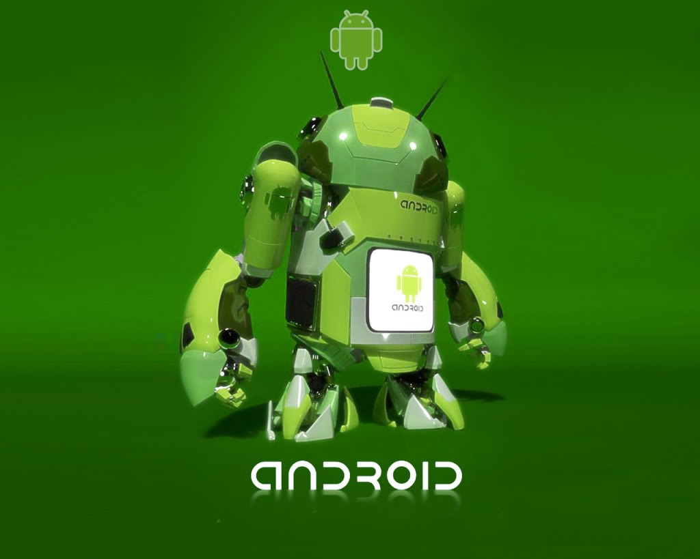
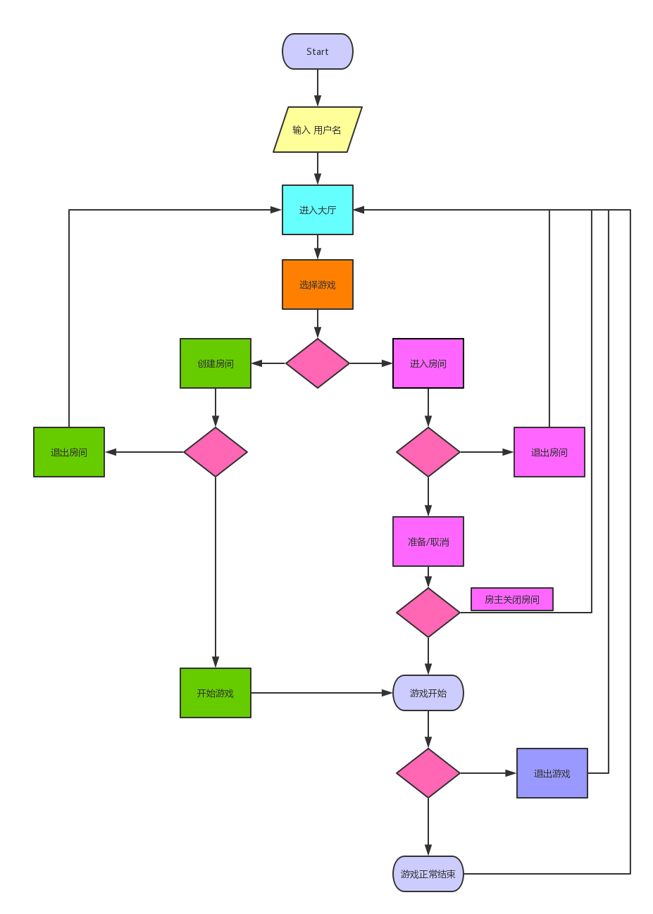
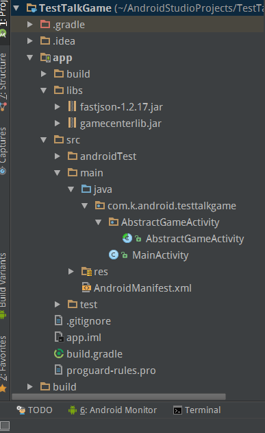

# BTGamesDevDemo

##  BTGames 
  是一个基于360的DroidPlugin的游戏平台。其作为Host程序，提供联机和载入游戏的功能。
  整个项目模仿红警联机的逻辑，流程如下：
  

##  目录结构
1.  LibsForDev : 开发所需的jar包和AbstractGameActivity
 * AbstractGameActivity ： 抽象游戏activity，根据需要可以随意改动
 * fastjson-1.2.17.jar : 阿里巴巴的fastjson包,AbstractGameActivity需要用来解析数据
 * gamecenterlib.jar ： AbstractGameActivity所需的包
2.  TestTalkGame : 一个双方轮流发消息的Demo游戏

##  TestTalkGame结构
 

